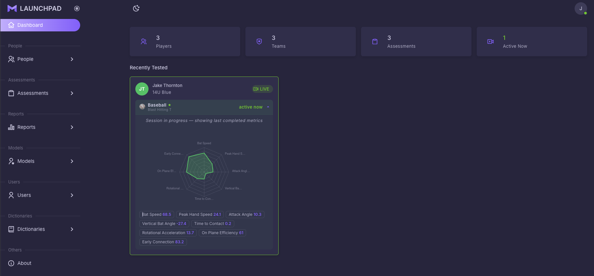
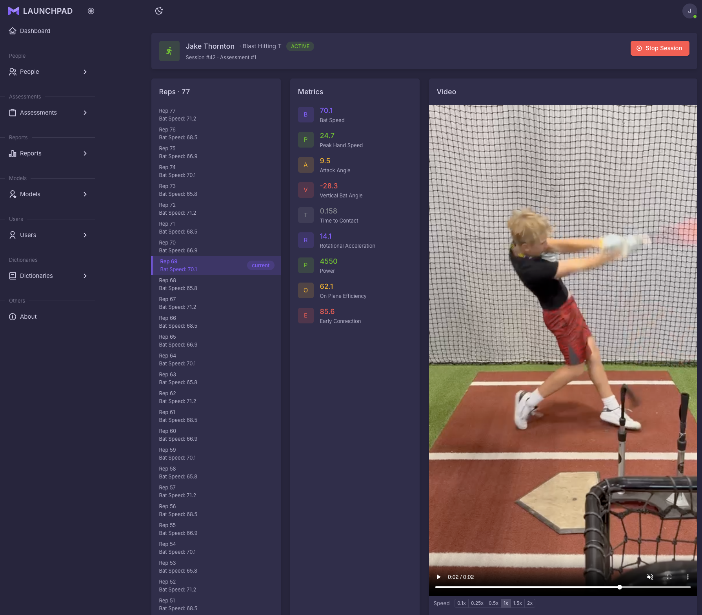
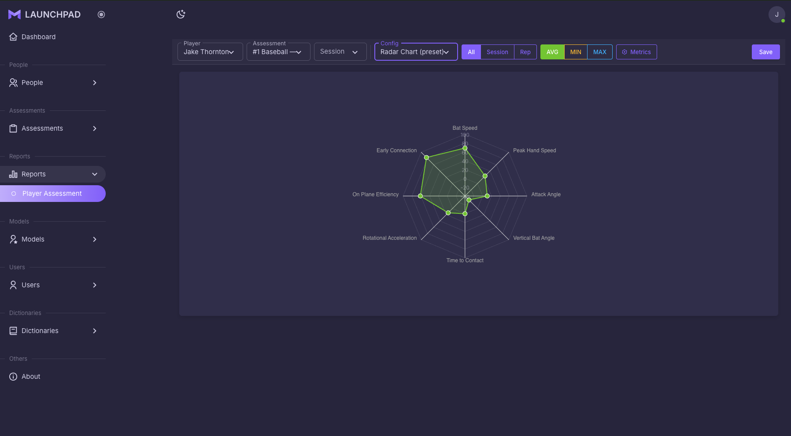
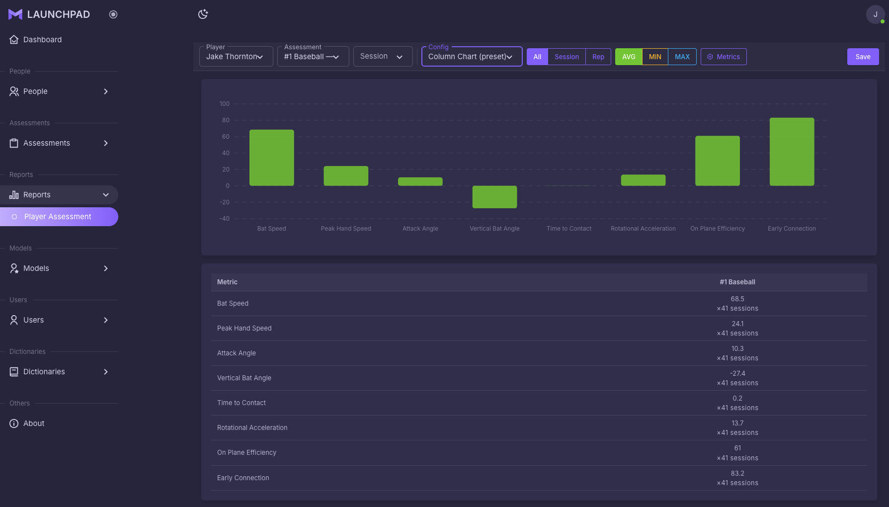
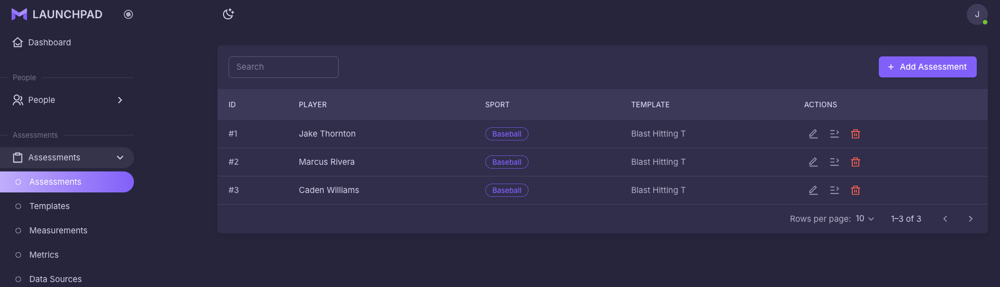
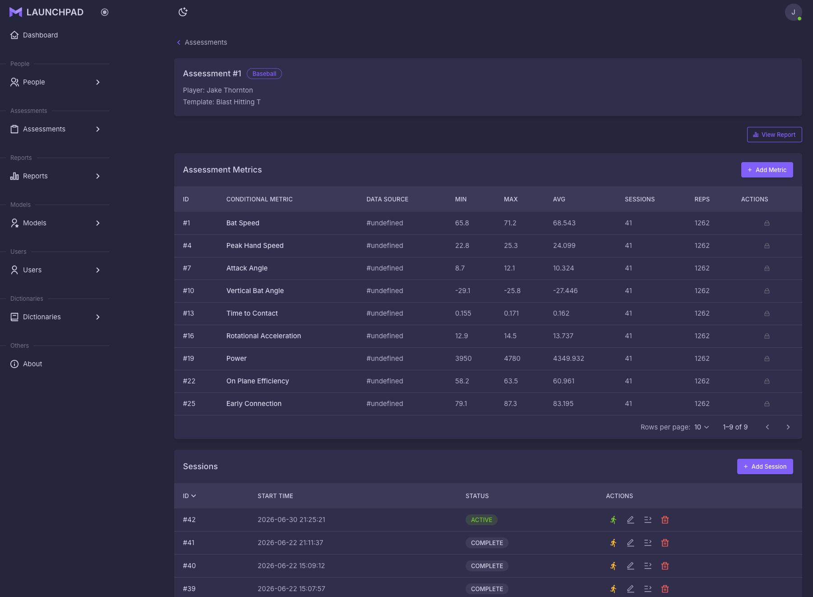

# Launchpad

SaaS platform for baseball facilities to measure player metrics and manage player development.

Built with Next.js 15, MUI v6, TypeScript. Connects to the [launchpad](../launchpad/) Spring Boot backend.

## Prerequisites

- Node 20+
- The [`launchpad`](../launchpad/) backend running locally on `http://localhost:8080`

## Getting Started

```bash
npm install
npm run dev
```

Open [http://localhost:3000](http://localhost:3000).

### Environment variables

Create `.env.local` (used server-side to reach the backend):

```bash
BACKEND_URL=http://localhost:8080/api/v1
BACKEND_USER=biolab
BACKEND_PASS=biolab
```

### Other commands

```bash
npm run build       # production build
npm run lint         # lint
npm run lint:fix     # lint with auto-fix
npm run format       # Prettier
```

There is no automated test suite for this repo yet — `npm run lint` is the
current quality gate.

## Project layout

- `src/app/(dashboard)/` — pages with the full sidebar + navbar shell
- `src/app/(blank-layout-pages)/` — no-chrome pages (login, 404)
- Pages are thin Server Components in `src/app/**/page.tsx`; UI logic lives in matching `src/views/` modules
- Path aliases: `@/` → `src/`, `@core/`, `@layouts/`, `@menu/`, `@assets/`, `@components/`, `@configs/`, `@views/`

See [`CLAUDE.md`](./CLAUDE.md) for full architecture and conventions
(theming, tables, forms, icons, domain types).

## Screenshots

### Dashboard
KPI summary cards (Players, Teams, Assessments, Active Now) with a Recently Tested feed showing per-player radar charts and metric badges.



### Live Session
Real-time session view: rep list with bat speed per rep, live metric panel, and synced video playback with speed controls.



### Report — Radar Chart
Player assessment report with a full radar chart visualization. Filter by session or rep, toggle AVG / MIN / MAX, and select metrics.



### Report — Column Chart
Same report in column chart mode with a metric summary table showing values and session counts below.



### Assessments List
Searchable table of all assessments — player name, sport badge, and template — with edit, sessions, and delete actions.



### Assessment Detail
Assessment page showing aggregated metrics (MIN / MAX / AVG across sessions and reps) and a sessions table with status badges.


